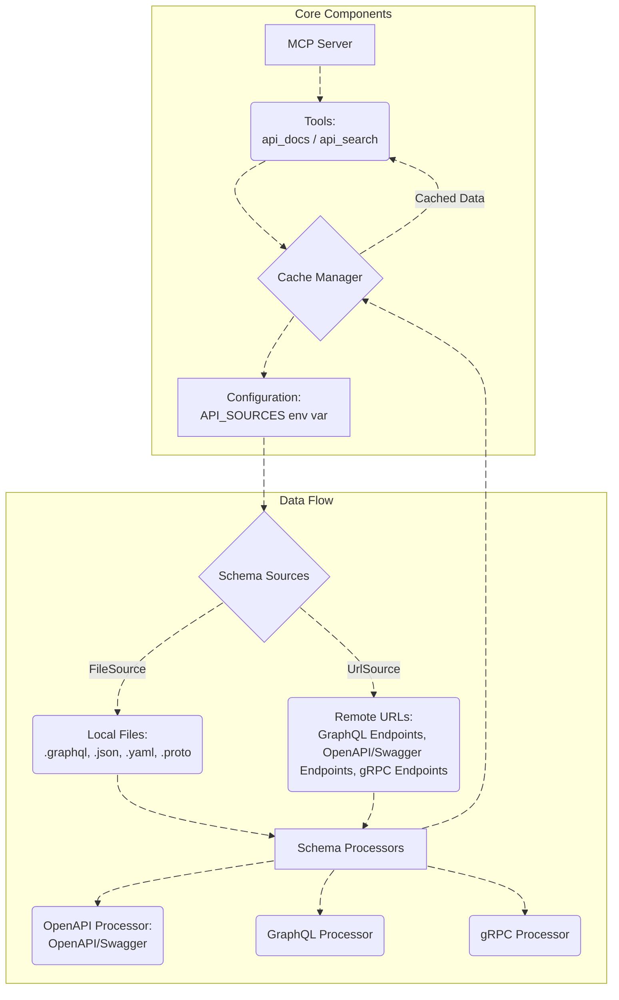

# API Docs MCP

Model Context Protocol (MCP) server that provides tools for interacting with API documentation. Supports GraphQL, OpenAPI/Swagger, and gRPC specifications, fetching schema definitions from various sources (local files or remote URLs), caching them, and exposing them through a set of tools.

## Table of Contents

- [API Docs MCP](#api-docs-mcp)
  - [Table of Contents](#table-of-contents)
  - [MCP Platforms](#mcp-platforms)
  - [Features](#features)
  - [Example Use Cases](#example-use-cases)
    - [OpenAPI Petstore retrieval docs](#openapi-petstore-retrieval-docs)
    - [GraphQL retrieval docs](#graphql-retrieval-docs)
    - [Multiple Sources retrieval docs](#multiple-sources-retrieval-docs)
  - [Architecture](#architecture)
  - [Installation](#installation)
  - [Configuration](#configuration)
    - [`FileSource` Example](#filesource-example)
    - [`UrlSource` Example](#urlsource-example)
    - [Setting the `API_SOURCES` Environment Variable](#setting-the-api_sources-environment-variable)
  - [Usage](#usage)
    - [API Docs Tool](#api-docs-tool)
    - [API Search Tool](#api-search-tool)
  - [Development](#development)
    - [Running the Server Locally](#running-the-server-locally)
    - [Project Structure](#project-structure)
  - [Contributing](#contributing)
  - [License](#license)

## MCP Platforms


## Features

- **Dynamic Tool Registration**: Automatically discovers and registers tools from a specified directory.
- **API Documentation Retrieval**: Provides tools to list available API methods (`api_docs`) and retrieve detailed documentation for specific methods (`api_search`).
- **Schema Caching**: Caches API schema information to reduce redundant fetches and improve performance.
- **Multiple Source Support**:
  - **GraphQL**: Supports loading GraphQL schemas from `graphql` / `gql` files or `json` introspection results (local files or remote URLs).
  - **OpenAPI/Swagger**: Supports loading OpenAPI/Swagger `yaml` / `yml` / `json` schemas from local files or remote URLs.
  - **gRPC**: Supports loading gRPC schemas from `proto` files or via gRPC reflection from remote URLs.
- **Environment-based Configuration**: Configures API sources via the `API_SOURCES` environment variable, allowing flexible deployment and management.
- **Automatic Cache Refresh**: Periodically refreshes cached schema data to ensure up-to-date documentation.

## Example Use Cases

### OpenAPI Petstore retrieval docs

<video src="https://github.com/user-attachments/assets/e2d73c08-7b4b-4157-bd17-aaf3090f67ec" width="100%" controls></video>

### GraphQL retrieval docs

<video src="https://github.com/user-attachments/assets/c597015a-ee9f-4f2d-a332-1f1785d88c86" width="100%" controls></video>

### Multiple Sources retrieval docs

<video src="https://github.com/user-attachments/assets/3bf7724e-bc74-46c5-9e57-919ea2ec7b52" width="100%" controls></video>

## Architecture

The `api-docs-mcp` project is designed as an MCP server that integrates with various API documentation sources.



**Flow of Operations:**

1. **Server Initialization**: The `index.ts` entry point initializes the MCP server and dynamically registers tools defined in the `src/tools` directory.
2. **Configuration Loading**: The `CacheManager` loads API source configurations from the `API_SOURCES` environment variable via `src/utils/config.ts`.
3. **Schema Fetching & Caching**:
   - Based on the configured sources (file-based or URL-based), the `CacheManager` fetches API schemas.
   - For file sources, it reads local files (`graphql`, `gql`, `json`, `yaml`, `yml`, `proto`).
   - For URL sources, it makes HTTP requests to GraphQL, OpenAPI, or gRPC endpoints.
   - Schemas are then processed by specialized handlers (`src/api/api.ts` for OpenAPI, `src/gql/gql.ts` for GraphQL, `src/grpc/grpc.ts` for gRPC).
   - The processed documentation is stored in an in-memory cache (`src/utils/cache.ts`) with a specified TTL (Time-To-Live).
   - The cache is periodically refreshed.
4. **Tool Usage**:
   - `api_docs`: When invoked, this tool retrieves a list of all available API resources from the cache, filtered by `source` if provided.
   - `api_search`: When invoked with a `detailName`, this tool provides detailed documentation (request, response, error structures) for a specific API resource from the cache.

## Installation

To set up the `api-docs-mcp` server, follow these steps:

1. **Clone the repository:**

   ```bash
   git clone https://github.com/EliFuzz/api-docs-mcp.git
   cd api-docs-mcp
   ```

2. **Install dependencies:**

   ```bash
   pnpm install
   ```

3. **Build the project:**

   ```bash
   pnpm build
   ```

## Configuration

The server's behavior is controlled by the `API_SOURCES` environment variable. This variable should contain a JSON string representing an array of `SchemaSource` objects. Each `SchemaSource` can be either a `FileSource` or a `UrlSource`.

### `FileSource` Example

For a local GraphQL schema:

```json
{
  "name": "MyGraphQLFile",
  "path": "/path/to/your/schema.graphql",
  "type": "gql"
}
```

For a local OpenAPI JSON schema:

```json
{
  "name": "MyOpenAPIFile",
  "path": "/path/to/your/openapi.json",
  "type": "api"
}
```

For a local gRPC proto file:

```json
{
  "name": "MyGrpcFile",
  "path": "/path/to/your/service.proto",
  "type": "grpc"
}
```

### `UrlSource` Example

For a remote GraphQL endpoint:

```json
{
  "name": "GitHubGraphQL",
  "method": "POST",
  "url": "https://api.github.com/graphql",
  "headers": {
    "Authorization": "Bearer YOUR_GITHUB_TOKEN"
  },
  "type": "gql"
}
```

For a remote OpenAPI endpoint:

```json
{
  "name": "PetstoreAPI",
  "method": "GET",
  "url": "https://petstore.swagger.io/v2/swagger.json",
  "type": "api"
}
```

For a remote gRPC endpoint with reflection:

```json
{
  "name": "MyGrpcService",
  "url": "grpc://localhost:9090",
  "type": "grpc"
}
```

### Setting the `API_SOURCES` Environment Variable

You can set this in your shell before running the server:

```bash
export API_SOURCES='[{"name": "MyGraphQLFile", "path": "./example/fixtures/graphql/graphql-schema.graphql", "type": "gql"}, {"name": "PetstoreAPI", "method": "GET", "url": "https://petstore.swagger.io/v2/swagger.json", "type": "api"}]'
```

Or in `mcp.json` for MCP execution:

```json
"api-docs-mcp": {
    "type": "stdio",
    "command": "npx",
    "args": [ "api-docs-mcp" ],
    "env": {
        "API_SOURCES": "[{\"name\": \"MyGraphQLFile\", \"path\": \"./example/fixtures/graphql/graphql-schema.graphql\", \"type\": \"gql\"}, {\"name\": \"PetstoreAPI\", \"method\": \"GET\", \"url\": \"https://petstore.swagger.io/v2/swagger.json\", \"type\": \"api\"}]"
    }
}
```

## Usage

Once configured and running, the `api-docs-mcp` server exposes two primary tools: `api_docs` and `api_search`.

### API Docs Tool

This tool provides a list of all available API methods from the configured sources.

**Name**: `api_docs`
**Description**: Get a list of all available API methods.
**Input Schema**:

```typescript
{
    source?: string; // The name of the API source (e.g., "GitHub") from MCP configuration environment variables. If not provided, docs from all sources will be returned.
}
```

**Output Schema**:

```typescript
{
  sources: Array<{
    name: string; // The name of the source API
    resources: Array<{
      name: string; // The name of the API resource
      description: string; // A brief description of the API resource
      resourceType: string; // The type of the API resource (e.g., "POST", "GET", "mutation", "query")
    }>;
  }>;
}
```

**Output Example**:

```json
{
  "sources": [
    {
      "name": "GitHubGraphQL",
      "resources": [
        {
          "name": "getUser",
          "description": "Fetch a user by username",
          "resourceType": "query"
        },
        {
          "name": "createIssue",
          "description": "Create a new issue in a repository",
          "resourceType": "mutation"
        }
      ]
    },
    {
      "name": "PetstoreAPI",
      "resources": [
        {
          "name": "getPetById",
          "description": "Find pet by ID",
          "resourceType": "GET"
        },
        {
          "name": "addPet",
          "description": "Add a new pet to the store",
          "resourceType": "POST"
        }
      ]
    }
  ]
}
```

### API Search Tool

This tool provides detailed documentation for a specific API method.

**Name**: `api_search`
**Description**: Search for a specific API method by name and get its full definition.
**Input Schema**:

```typescript
{
  detailName: string; // The exact resource name of the API method to search for that was provided in `api_docs` tool's output
}
```

**Output Schema**:

```typescript
{
  details: Array<{
    name: string; // The name of the cache entry
    resources: Array<{
      name: string; // The name of the resource
      resourceType: "query" | "mutation" | "subscription"; // The type of GraphQL resource
      description: string; // Context or description of the resource
      details: {
        request?: string; // The request structure or input parameters for the API method
        response?: string; // The response structure or output format for the API method
        error?: string; // Error information or error handling details for the API method
      };
    }>;
  }>;
}
```

**Output Example**:

```json
{
  "details": [
    {
      "name": "GitHubGraphQL",
      "resources": [
        {
          "name": "getUser",
          "resourceType": "query",
          "description": "Fetch a user by username",
          "details": {
            "request": "{ username: String! }",
            "response": "{ id: ID!, login: String!, name: String }",
            "error": "{ message: String!, code: Int! }"
          }
        }
      ]
    }
  ]
}
```

## Development

### Running the Server Locally

1. **Set the `API_SOURCES` environment variable** as described in the [Configuration](#configuration) section.
2. **Start the server:**

   ```bash
   pnpm start
   ```

The server will connect to a `StdioServerTransport`, meaning it will communicate over standard input/output.

### Project Structure

```markdown
.
├── src/
│ ├── api/ # OpenAPI/Swagger schema processing
│ │ └── api.ts
│ ├── gql/ # GraphQL schema processing
│ │ └── gql.ts
│ ├── grpc/ # gRPC schema processing
│ │ └── grpc.ts
│ ├── tools/ # MCP tools definitions
│ │ ├── api_docs.ts
│ │ └── api_search.ts
│ ├── utils/ # Utility functions (cache, config, fetch, file, source)
│ │ ├── cache.ts
│ │ ├── config.ts
│ │ ├── fetch.ts
│ │ ├── file.ts
│ │ └── source.ts
│ ├── index.ts # Main entry point
│ └── server.ts # MCP server setup and tool registration
└── package.json # Project dependencies and scripts
└── README.md # This file
```

## Contributing

Contributions are welcome! Please feel free to open issues or submit pull requests.

## License

This project is licensed under the Apache 2.0 License. See the [LICENSE](LICENSE) file for details.
